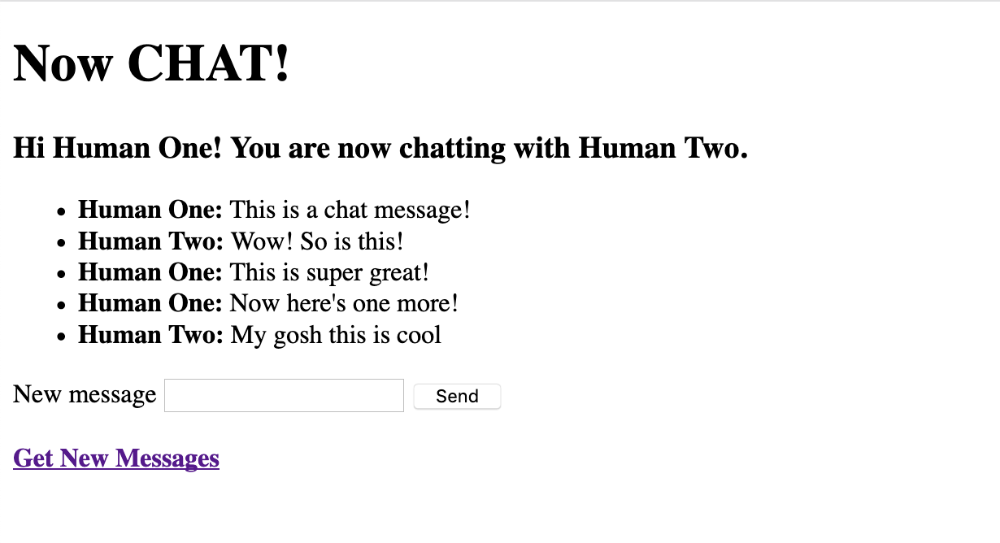

# Chat Time!

Chat time is a small experimental app built in Ruby on Rails with a PostgreSQL database that allows two users to chat with each other. 



## Features
Chat time allows a user to indicate who they are, and with whom they would like to chat. 


It then displays the chat history between the two users, allows the user to enter a new message, and saves that to the chat history between the two users. It also provides a "Get New Messages" link that will refresh the page and allow the user to see any new messages that may have come in. 


### Schema Design
Chat Time has a very straight-forward schema. Messages have a `content` string along with a `sender` and a `receiver`, both of which are foreign keys to the `users` table. Users just have a `name` string. 

This design requires that Chat Time remains a one-to-one person chat app - a message can have only one `receiver`, so no sending messages to multiple people! This decision was intended to keep Chat Time a very basic chat app. 


In the future, if I wanted to implement multi-person chats, I could add a `user_messages` join table. In this scenario, `messages` would have `content` and a `sender` foreign key. The `user_messages` table would have `message_id` and `receiver_id` foreign keys. The logic for retrieving chat history would also have to be revised.  


### Future Iterations
The goal behind this app was to get a small app working quickly. With more time, here are some of the things I would like to implement!
* Some form of auto-reloading or auto-fetching of new messages, so that users would not have to use the "Get New Messages" link. 
  * One way to do this would be to fetch the messages on the chat page using a jQuery function instead of the `@messages` instance variable in the ChatController. This could then be set to reload every few seconds.
  * I chose to make this a full-stack Rails app, but the above could also be part of a re-work to make this a Rails API backend with a JavaScript-based frontend, perhaps a single-page app. 
  * In order to explore the Rails ecosystem more, I would like to keep this a full-stack Rails app and use [ActionCable](https://guides.rubyonrails.org/action_cable_overview.html), the Rails implementation of WebSockets, to provide real-time updates as new messages are created. This could also give you functionality such as notifications about whether the user you are chatting with is online. 
* Authentication and authorization.
  * Currently users are created as needed, with the name functioning as a unique validator. 
  * Authentication and authorization would of course provide security to a user's identity and history in the app, where none currently exists.
  * Moving to a model where a user is logged in would simplify some of the existing logic where users need to be passed around using hidden fields and the like. Instead, sessions and cookies could be leveraged. 
* Error handling and more robust testing
  * A lot of this would be linked to implementing authorization and authentication, above. 
  * Make sure that errors are handled gracefully.
  * Take a look at things like character limits or restrictions for the message content. 
* Styling!
  * As minimalist chic as default browser styling is, Chat Time could probably use a little bit of styling help.
  * What happens when the chat history gets long? Putting the chat history in some sort of separate section that auto-scrolls to the most recent messages would make sense, as well as limiting the number to the most recent e.g. 50 messages. 


## Installing Locally
To run Chat Time on your local machine, navigate to the directory in which you would like to install it, and run the following commands to clone the repository and set up the database.
```
git clone git@github.com:asmolentzov/chat_time.git
cd chat_time
bundle install
bundle exec rake db:{create,migrate,seed}
```
You can then run the app using
```
bundle exec rails s
```
and access the app by pointing your browser to `http://localhost:3000`

### Testing
Chat time is tested using RSpec with Capybara. To run the test suite:
```
bundle exec rspec
```
Green means passing tests, red means failing.

## Built With
* [Ruby 2.4.5](https://ruby-doc.org/core-2.4.5/)
* [Rails 5.2.3](https://guides.rubyonrails.org/)
* [RSpec](http://rspec.info/)
* [Capybara](https://github.com/teamcapybara/capybara/blob/3.12_stable/README.md)
* [PostgreSQL](https://www.postgresql.org/)


